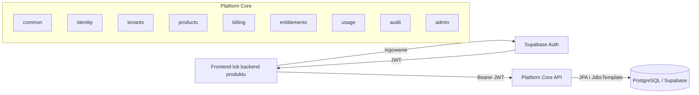
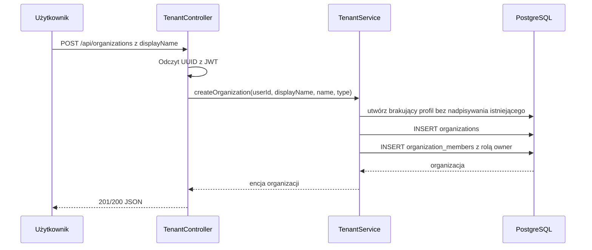
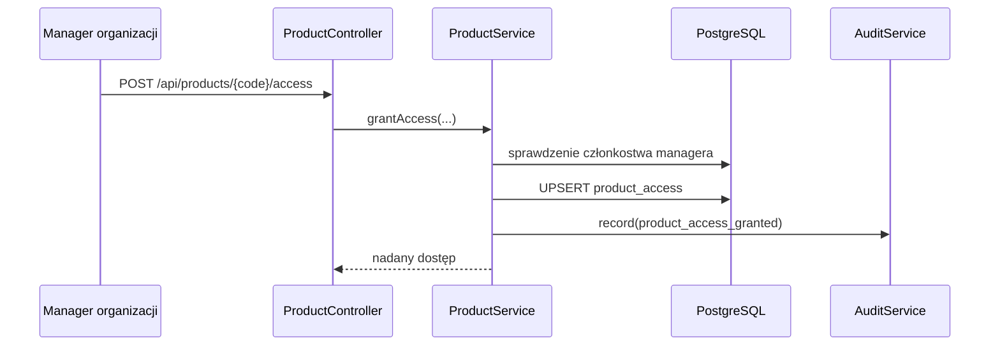
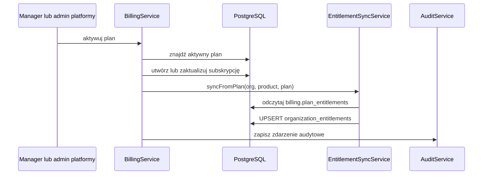
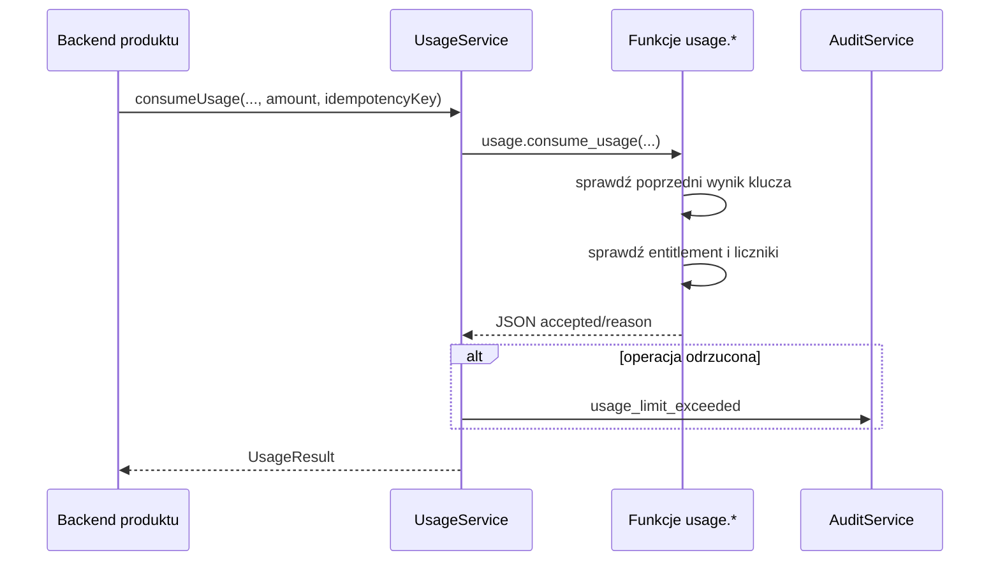
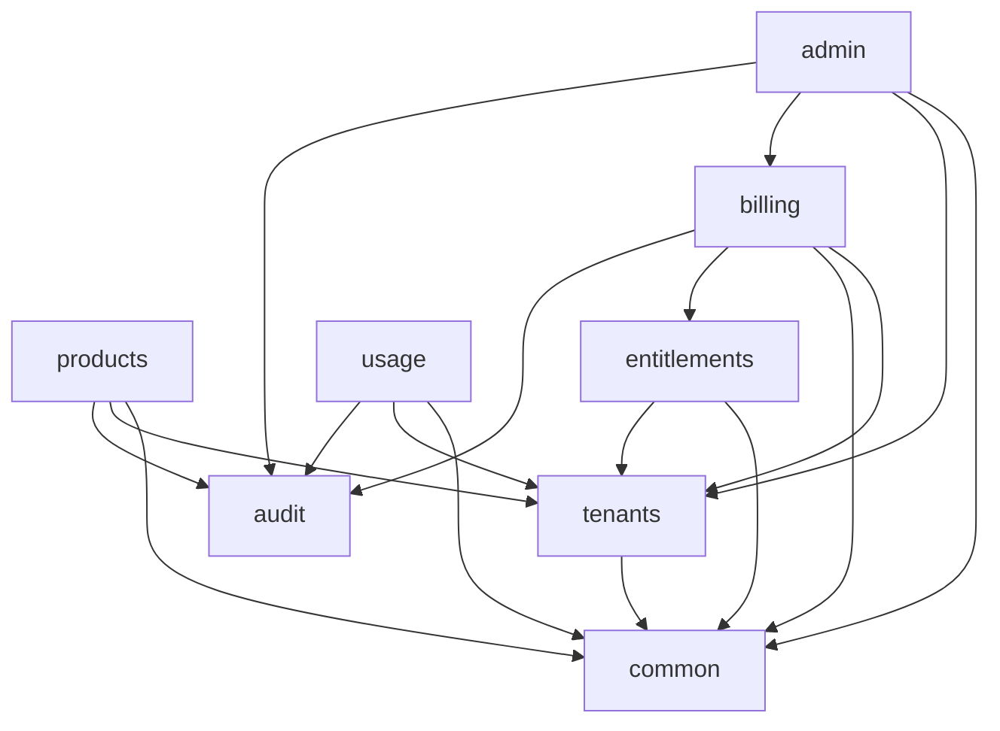

# Platform Core - przewodnik po aktualnej implementacji

## 1. Cel aplikacji

`platform-core` jest centralnym backendem dla rodziny produktów SaaS. Zamiast
implementować w każdym produkcie osobno użytkowników, organizacje, plany,
limity i rozliczanie użycia, aplikacja udostępnia te funkcje jako wspólny
rdzeń.

Aktualna aplikacja jest **modularnym monolitem**:

- uruchamia się jako jeden proces Spring Boot,
- korzysta z jednej bazy PostgreSQL w Supabase,
- jest podzielona w kodzie na moduły biznesowe,
- może być rozwijana i wdrażana jako jedna całość,
- zachowuje granice, które mają ułatwić przyszłe wydzielenie wybranych części.

Nie jest to zestaw mikroserwisów. Wywołanie z modułu billing do modułu
entitlements jest zwykłym wywołaniem metody w tym samym procesie.

## 2. Technologie

| Element | Zastosowanie |
|---|---|
| Java 21 | Język aplikacji |
| Spring Boot 4.1 | Uruchomienie aplikacji, HTTP, konfiguracja |
| Spring Security | Walidacja JWT i ochrona endpointów |
| Spring Data JPA | Operacje na encjach i repozytoria |
| JdbcTemplate | Wywołania funkcji PostgreSQL i bardziej złożony SQL |
| Spring Modulith | Opis i testowanie granic modułów |
| Flyway | Tworzenie i aktualizacja struktury bazy |
| PostgreSQL / Supabase | Dane, funkcje SQL i Row Level Security |
| Testcontainers | PostgreSQL uruchamiany w Dockerze podczas testów |
| Lombok | Generowanie konstruktorów, getterów i builderów |

## 3. Widok całości



Typowe żądanie wygląda następująco:

1. Użytkownik loguje się przez Supabase Auth.
2. Supabase wydaje JWT, którego pole `sub` zawiera UUID użytkownika.
3. Klient przesyła token w nagłówku `Authorization: Bearer ...`.
4. Spring Security sprawdza podpis i ważność tokenu.
5. Kontroler odczytuje JWT przez `@AuthenticationPrincipal`.
6. `JwtUser` zamienia `sub` na `UUID`.
7. Serwis sprawdza uprawnienia i wykonuje operację w bazie.
8. Kontroler zwraca DTO jako JSON.

## 4. Moduły aplikacji

### 4.1 common

Moduł techniczny współdzielony przez pozostałe części aplikacji. Zawiera:

- konfigurację Spring Security,
- mapowanie ról z JWT,
- konfigurację puli wątków dla asynchronicznego audytu,
- odczyt UUID użytkownika z JWT,
- wspólne wyjątki,
- globalne mapowanie wyjątków na kody HTTP.

`common` nie jest oznaczony jako osobny moduł Modulith. Pełni rolę wspólnej
warstwy infrastrukturalnej.

### 4.2 identity

Przechowuje profil użytkownika powiązany z `auth.users` Supabase.

`ProfileService` potrafi:

- znaleźć profil po identyfikatorze użytkownika,
- zaktualizować nazwę profilu,
- utworzyć profil, jeżeli jeszcze nie istnieje,
- zapewnić istnienie profilu bez nadpisywania wcześniej zapisanej nazwy,
- obsłużyć wyścig dwóch równoczesnych prób utworzenia tego samego profilu.

Endpoint `PUT /api/profile` tworzy profil albo aktualizuje jego nazwę. UUID
użytkownika jest zawsze pobierany z JWT, a nie z treści żądania.

Profil może powstać trzema drogami:

1. Trigger Supabase po utworzeniu rekordu `auth.users`.
2. Jawne wywołanie `PUT /api/profile` przez frontend.
3. Zabezpieczenie w `TenantService.createOrganization()`, gdy użytkownik tworzy
   pierwszą organizację.

Trzecia ścieżka używa `ensureProfileExists()`. Tworzy brakujący rekord, ale nie
zmienia istniejącego profilu. Dzięki temu nazwa ustawiona wcześniej przez
użytkownika nie zostanie przypadkowo nadpisana.

W aktualnej implementacji tworzenie profilu nie używa zwykłego
`profileRepository.save()`. Powodem jest zachowanie Hibernate: zapis encji może
zostać odłożony do `flush` przy końcu transakcji, więc konflikt unikalnego
`user_id` pojawiłby się już poza lokalnym blokiem obsługi błędu. Dlatego
`ProfileService` używa atomowego SQL przez `JdbcTemplate`:

- `upsertProfile()` wykonuje `INSERT ... ON CONFLICT (user_id) DO UPDATE` i
  aktualizuje `display_name`;
- `ensureProfileExists()` wykonuje `INSERT ... ON CONFLICT (user_id) DO NOTHING`
  i w razie konfliktu odczytuje istniejący profil.

Te dwie metody celowo nie współdzielą jednej metody tworzącej. Ich kontrakty są
różne: endpoint profilu ma prawo zmienić nazwę, a zabezpieczenie przy tworzeniu
organizacji ma tylko zapewnić istnienie rekordu bez nadpisywania danych
ustawionych wcześniej przez użytkownika.

Migracja V4 przygotowuje funkcję `platform.handle_new_user()`, ale nie może
utworzyć triggera na zarządzanej tabeli `auth.users`. Trigger instaluje się
ręcznie skryptem `docs/deployment/supabase-profile-trigger.sql`.

### 4.3 tenants

Zarządza organizacjami, czyli tenantami platformy.

Najważniejsze pojęcia:

- organizacja grupuje użytkowników, subskrypcje, uprawnienia i użycie,
- użytkownik może należeć do wielu organizacji,
- członkostwo ma rolę `owner`, `admin` lub `member`,
- tylko aktywne członkostwo pozwala korzystać z organizacji,
- właściciel i administrator mogą dodawać członków.



Utworzenie organizacji i członkostwa właściciela odbywa się w jednej
transakcji. Jeżeli zapis członkostwa się nie powiedzie, organizacja również
nie zostanie zatwierdzona.

### 4.4 products

Moduł przechowuje katalog produktów i dwa różne rodzaje informacji:

- `product_registrations` - użytkownik zaakceptował warunki produktu,
- `product_access` - użytkownik ma aktywny dostęp i rolę w produkcie.

Sama rejestracja nie oznacza jeszcze dostępu. Dostęp nadaje manager
organizacji.



Sprawdzenie dostępu korzysta z funkcji PostgreSQL
`platform.check_product_access(...)`, która zwraca JSON.

### 4.5 billing

Billing zarządza:

- katalogiem planów,
- subskrypcją organizacji na produkt,
- statusem i okresem subskrypcji,
- wyzwoleniem synchronizacji entitlementów.

Aktualnie wspierany jest provider `manual`. Pola dla Stripe, PayU i innych
providerów istnieją w tabeli, ale integracje nie są zaimplementowane.



Anulowanie subskrypcji przełącza organizację na plan `free`, jeżeli taki plan
istnieje. W przeciwnym razie entitlementy pochodzące z planu są wyłączane.

### 4.6 entitlements

Entitlement oznacza funkcję lub limit, do którego organizacja albo użytkownik
ma prawo.

Przykłady:

- funkcja `basic_search`,
- limit 1000 operacji `ai_search_usage` miesięcznie,
- limit 100000 tokenów miesięcznie.

Źródłem standardowych entitlementów jest `billing.plan_entitlements`.
Synchronizacja planu wykonuje upsert zamiast usuwania wszystkich rekordów.
Entitlementy nieobecne w nowym planie są wyłączane.

Jeżeli istnieje limit organizacji i dodatkowy limit użytkownika, obowiązuje
bardziej restrykcyjny limit. Okresy obu limitów muszą być zgodne.

### 4.7 usage

Moduł usage realizuje pomiar operacji podlegających limitom.

Obsługuje dwa tryby:

1. **consume** - od razu dolicza faktyczne użycie,
2. **reserve/finalize** - najpierw rezerwuje przewidywaną ilość, a później
   zamienia ją na faktyczne użycie.

Każda operacja przyjmuje klucz idempotencji. Ponowienie tego samego żądania z
tym samym kluczem nie powinno naliczyć użycia po raz drugi.



Główna logika współbieżności i aktualizacji liczników znajduje się w
funkcjach PostgreSQL z migracji V12.

### 4.8 audit

Audit zapisuje ważne zdarzenia biznesowe, na przykład:

- nadanie lub odebranie dostępu do produktu,
- zmianę subskrypcji,
- odrzucenie operacji usage,
- ręczną zmianę entitlementu przez administratora.

Wywołanie `AuditService.record()` jest asynchroniczne. Metoda działa w osobnej
transakcji `REQUIRES_NEW`, dzięki czemu błąd audytu nie wycofuje głównej
operacji biznesowej.

Audit nie używa zdarzeń Spring Modulith. Serwisy wywołują `AuditService`
bezpośrednio.

### 4.9 admin

Moduł udostępnia operacyjne API dla administratora platformy:

- listowanie organizacji,
- odczyt szczegółów organizacji,
- ręczna aktywacja i zmiana subskrypcji,
- ręczne nadpisanie entitlementu,
- podgląd liczników usage,
- filtrowanie logu audytowego.

Wszystkie kontrolery admin mają `@PreAuthorize("hasRole('ADMIN')")`.
Rola jest odczytywana wyłącznie z claimów JWT przeznaczonych do autoryzacji,
w tym z `app_metadata`. Dane z edytowalnego przez użytkownika
`user_metadata` nie są używane do nadawania roli.

## 5. Spring Modulith i granice modułów

Każdy moduł domenowy ma `package-info.java` z adnotacją
`@ApplicationModule`. Spring Modulith buduje na tej podstawie model aplikacji.

Test:

```java
ApplicationModules.of(PlatformCoreApplication.class).verify();
```

sprawdza przede wszystkim:

- czy między modułami nie ma cykli zależności,
- czy kod nie odwołuje się do typów ukrytych w pakietach wewnętrznych.

Obecna ochrona jest ograniczona. Projekt nie definiuje podpakietów `internal`,
`NamedInterface` ani `allowedDependencies`. Oznacza to, że publiczne klasy,
encje i repozytoria modułu mogą być używane przez inne moduły, a test nadal
przejdzie. Przykładem jest `AdminReadService`, który korzysta bezpośrednio z
repozytoriów tenants i billing.



Strzałka oznacza, że moduł źródłowy korzysta z publicznego typu lub serwisu
modułu docelowego. Diagram pokazuje stan aktualny, a nie idealną docelową
architekturę.

### Infrastruktura publikacji zdarzeń

Projekt zawiera `spring-modulith-starter-jpa`. Migracja V1 tworzy tabele:

- `platform.event_publication`,
- `platform.event_publication_archive`.

Automatyczna inicjalizacja schematu Modulith jest wyłączona w
`application.yaml`, ponieważ strukturą bazy zarządza Flyway.

Mapowania JPA biblioteki używają nazw `EVENT_PUBLICATION` i
`EVENT_PUBLICATION_ARCHIVE` bez jawnego schematu. PostgreSQL zamienia
niecytowane nazwy na małe litery, a `hibernate.default_schema=platform`
kieruje mapowania do tabel utworzonych przez V1. Test integracyjny zapisuje
publikację przez prawdziwy `EventPublicationRegistry`, oznacza ją jako
zakończoną i potwierdza przeniesienie do tabeli archiwalnej.

Kod nie używa jednak `ApplicationEventPublisher` ani
`@ApplicationModuleListener`. Tabele są przygotowaną, ale obecnie nieużywaną
infrastrukturą. Asynchroniczny audit jest zwykłym wywołaniem metody oznaczonej
`@Async`, a nie zdarzeniem modułowym.

## 6. Baza danych i RLS

Flyway jest źródłem prawdy dla trwałej struktury bazy. Hibernate działa z
`ddl-auto: validate`, więc może sprawdzić mapowanie encji, ale nie powinien
tworzyć tabel.

Schematy:

- `platform` - użytkownicy, organizacje, produkty i dostęp,
- `billing` - plany i subskrypcje,
- `entitlement` - funkcje, metryki i limity,
- `usage` - liczniki, rezerwacje i zdarzenia,
- `audit` - log audytowy,
- `search_saas` - przykładowa tabela produktu.

RLS ma dwa konteksty:

- zapytania klientów Supabase przez Data API używają `auth.uid()`,
- backend Spring przez JDBC jawnie przekazuje `userId` do funkcji SQL.

Rozdzielenie jest konieczne, ponieważ zwykła sesja JDBC nie zawiera claimów JWT
ustawianych przez PostgREST.

## 7. Bezpieczeństwo

- Wszystkie endpointy poza `/actuator/health` wymagają uwierzytelnienia.
- JWT jest walidowany przez Spring OAuth2 Resource Server.
- `sub` musi być UUID.
- Endpointy admin wymagają `ROLE_ADMIN`.
- Autoryzacja organizacji jest dodatkowo sprawdzana w serwisach.
- Sekrety są przekazywane przez zmienne środowiskowe.
- `.env` i `.claude/settings.local.json` są ignorowane przez Git.
- Metadata usage i audit nie powinna zawierać promptów, danych produktu ani
  innych informacji wrażliwych.

## 8. Jak uruchomić projekt

Wymagane zmienne:

```text
SUPABASE_JDBC_URL
SUPABASE_DB_USER
SUPABASE_DB_PASSWORD
SUPABASE_JWT_ISSUER_URI
```

Testy:

```powershell
.\mvnw.cmd clean verify
```

Uruchomienie:

```powershell
.\mvnw.cmd spring-boot:run
```

Health check:

```text
GET http://localhost:8080/actuator/health
```

Testy integracyjne wymagają działającego Dockera, ponieważ uruchamiają
PostgreSQL przez Testcontainers.

### Konfiguracja triggera profilu w Supabase

Po wykonaniu migracji Flyway administrator projektu otwiera Supabase Dashboard,
przechodzi do SQL Editor i uruchamia:

```text
docs/deployment/supabase-profile-trigger.sql
```

Następnie należy utworzyć użytkownika testowego i sprawdzić:

```sql
select user_id, display_name
from platform.profiles
where user_id = '<uuid użytkownika>';
```

Trigger działa w transakcji rejestracji. Błąd funkcji triggera może zablokować
utworzenie konta, dlatego po wdrożeniu trzeba wykonać rzeczywisty test
rejestracji. Skrypt zawiera również polecenie wycofania samego triggera.
