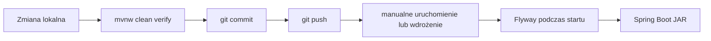

# Platform Core - katalog techniczny i stan powdrożeniowy

## 1. Status dokumentu

Dokument opisuje kod po migracji V19 i commicie końcowej weryfikacji
architektury. Jest katalogiem stanu faktycznego. HLD, LLD i ADR pozostają
dokumentami projektowymi.

## 2. Publiczne API

Wszystkie endpointy poza health checkiem wymagają poprawnego JWT.

### Organizacje

| Metoda | Ścieżka | Działanie |
|---|---|---|
| POST | `/api/organizations` | Tworzy organizację i właściciela |
| GET | `/api/organizations` | Zwraca organizacje użytkownika |
| POST | `/api/organizations/{id}/members` | Dodaje członka; wymaga owner/admin |

### Produkty

| Metoda | Ścieżka | Działanie |
|---|---|---|
| POST | `/api/products/{code}/register` | Rejestruje użytkownika w produkcie |
| POST | `/api/products/{code}/access` | Nadaje dostęp użytkownikowi |
| DELETE | `/api/organizations/{organizationId}/products/{code}/access/{userId}` | Odbiera dostęp |
| GET | `/api/products/{code}/access` | Sprawdza dostęp własny lub wskazanego użytkownika |

### Entitlements

| Metoda | Ścieżka | Działanie |
|---|---|---|
| GET | `/api/organizations/{id}/entitlements/{productCode}` | Zwraca aktywne entitlementy organizacji |

### Billing

| Metoda | Ścieżka | Działanie |
|---|---|---|
| POST | `/api/organizations/{organizationId}/subscriptions` | Aktywuje ręczną subskrypcję |
| DELETE | `/api/organizations/{organizationId}/subscriptions/{productCode}` | Anuluje subskrypcję |
| GET | `/api/organizations/{organizationId}/subscriptions` | Zwraca subskrypcje organizacji |

### Usage

| Metoda | Ścieżka | Działanie |
|---|---|---|
| POST | `/api/usage/consume` | Natychmiast nalicza użycie |
| POST | `/api/usage/reserve` | Rezerwuje przewidywane użycie |
| POST | `/api/usage/finalize` | Finalizuje rezerwację faktyczną ilością |
| GET | `/api/organizations/{id}/usage/{productCode}` | Zwraca podsumowanie liczników |

### Admin

Wszystkie ścieżki wymagają `ROLE_ADMIN`.

| Metoda | Ścieżka | Działanie |
|---|---|---|
| GET | `/admin/organizations` | Lista organizacji z paginacją |
| GET | `/admin/organizations/{id}` | Szczegóły organizacji |
| POST | `/admin/organizations/{id}/subscriptions` | Ręczna aktywacja planu |
| PUT | `/admin/organizations/{id}/subscriptions/{productCode}` | Zmiana planu lub statusu |
| PUT | `/admin/organizations/{id}/entitlements` | Ręczny override entitlementu |
| GET | `/admin/organizations/{id}/usage` | Operacyjny podgląd liczników |
| GET | `/admin/audit` | Filtrowanie logu audytowego |

### Operacyjne

| Metoda | Ścieżka | Działanie |
|---|---|---|
| GET | `/actuator/health` | Publiczny health check |

## 3. Moduły i zależności

| Moduł | Odpowiedzialność | Istotne zależności |
|---|---|---|
| identity | Profile użytkowników | Supabase `auth.users` |
| tenants | Organizacje i członkostwa | common |
| products | Rejestracje i dostęp | tenants, audit |
| entitlements | Funkcje i limity | tenants |
| billing | Plany i subskrypcje | tenants, entitlements, audit |
| usage | Liczniki i rezerwacje | tenants, audit |
| audit | Asynchroniczny zapis zdarzeń | common async executor |
| admin | Operacyjne API | tenants, billing, audit |
| common | Security, błędy i konfiguracja | infrastruktura Spring |

Granice są testowane przez `ModulithArchitectureTests`. Test wykrywa cykle,
ale nie zabrania używania publicznych repozytoriów innych modułów. Projekt nie
ma obecnie podpakietów `internal` ani jawnych interfejsów nazwanych.

## 4. Migracje i obiekty bazy

| Migracja | Najważniejsze obiekty |
|---|---|
| V1 | Schematy, role, domyślne granty, tabele publikacji Modulith |
| V2 | Profile, organizacje, członkostwa |
| V3 | `is_org_member`, RLS platformy |
| V4 | `handle_new_user` |
| V5 | Produkty, rejestracje, dostęp |
| V6 | Funkcje dostępu do produktu |
| V7 | Seed katalogu produktów |
| V8 | Features, metrics, entitlements i `billing.plan_entitlements` |
| V9 | `get_entitlements` |
| V10 | Seed features, metrics i plan entitlements |
| V11 | Liczniki, rezerwacje i zdarzenia usage |
| V12 | Funkcje consume, reserve i finalize |
| V13 | Audit events |
| V14 | Append-only granty audytu |
| V15 | Plany i subskrypcje |
| V16 | Seed planów free/pro |
| V17 | Schemat i tabela `search_saas.search_queries` |
| V18 | Ujednolicenie nazw `search_type` |
| V19 | `admin_override` dla entitlementów organizacji |

### Funkcje PostgreSQL

- `platform.is_org_member`
- `platform.has_product_access`
- `platform.check_product_access`
- `platform.handle_new_user`
- `entitlement.get_entitlements`
- `usage.period_bounds_at`
- `usage.consume_usage`
- `usage.reserve_usage`
- `usage.finalize_usage`

Funkcje backendowe przyjmują jawny identyfikator użytkownika. Polityki RLS dla
klientów Supabase pobierają użytkownika przez `auth.uid()`.

## 5. Dane startowe

Katalog produktów:

- `search_saas`,
- `grant_saas`,
- `architecture_saas`.

Tylko `search_saas` ma obecnie features, metrics, plany i własny schemat.

Plany `search_saas`:

| Plan | Cena | Entitlements |
|---|---:|---|
| free | 0 USD/miesiąc | basic search; 100 użyć AI/miesiąc |
| pro | 29 USD/miesiąc | basic search; 1000 użyć AI; 100000 tokenów |

## 6. Konfiguracja

| Zmienna | Znaczenie |
|---|---|
| `SUPABASE_JDBC_URL` | JDBC URL PostgreSQL |
| `SUPABASE_DB_USER` | Użytkownik połączenia |
| `SUPABASE_DB_PASSWORD` | Hasło bazy |
| `SUPABASE_JWT_ISSUER_URI` | Issuer tokenów Supabase Auth |

Istotne ustawienia:

- `spring.jpa.hibernate.ddl-auto=validate`,
- Flyway zarządza schematem,
- domyślny schemat Hibernate to `platform`,
- inicjalizacja tabel Modulith przez framework jest wyłączona,
- `/actuator/health` jest publiczny,
- pozostałe endpointy wymagają JWT,
- sesje HTTP są stateless.

## 7. Testy

`mvnw clean verify` wykonuje:

- testy jednostkowe serwisów,
- testy migracji i funkcji na PostgreSQL z Testcontainers,
- test pełnego kontekstu Spring Boot,
- rzeczywisty request HTTP do `/actuator/health`,
- `ApplicationModules.verify()` dla granic Modulith,
- budowę wykonywalnego JAR.

Testowy PostgreSQL dostaje minimalny schemat `auth` przez
`test-auth-stub.sql`. Nie jest to pełny Supabase.

Obraz kontenera jest wskazany jako `postgres:latest`. Zapewnia świeżą wersję,
ale zmniejsza powtarzalność pipeline'u, ponieważ wynik może zmienić się bez
zmiany kodu.

## 8. Aktualny model CI/CD

### 8.1 Stan wdrożony

Repozytorium ma remote GitHub:

```text
https://github.com/Okropniak/platform-core.git
```

Nie ma jednak:

- `.github/workflows`,
- GitHub Actions ani innego serwera CI,
- Dockerfile,
- publikacji obrazu do registry,
- automatycznego środowiska staging,
- skryptów infrastruktury,
- automatycznego deploymentu,
- automatycznego rollbacku,
- retencji i promocji artefaktów.

Aktualny proces jest ręczny:



Lokalną bramką jakości jest:

```powershell
.\mvnw.cmd clean verify
```

Maven buduje wykonywalny plik:

```text
target/platform-core-0.0.1-SNAPSHOT.jar
```

Przy starcie aplikacji Flyway automatycznie sprawdza i wykonuje brakujące
migracje. Oznacza to, że wdrożenie kodu i zmiana schematu są powiązane z
uruchomieniem tej samej wersji aplikacji.

Sekrety są przekazywane ręcznie przez środowisko uruchomieniowe. Lokalne pliki
`.env` oraz `.claude/settings.local.json` są ignorowane przez Git.

### 8.2 Różnica względem HLD

HLD rekomenduje początkowo:

- VPS,
- Docker,
- Coolify lub Dokploy,
- reverse proxy.

Żaden z tych elementów nie jest skonfigurowany w repozytorium. Jest to plan
wdrożenia, a nie stan aktualny.

### 8.3 Rekomendowany następny etap

Poniższe elementy nie są wdrożone, ale stanowią logiczny kolejny krok:

1. GitHub Actions uruchamiający `mvnw clean verify` dla pull requestów.
2. Przypięcie wersji obrazu PostgreSQL w Testcontainers.
3. Dockerfile budujący obraz z gotowego JAR.
4. Publikacja obrazu do GitHub Container Registry.
5. Oddzielne środowisko staging z osobną bazą Supabase.
6. Deployment produkcyjny dopiero po przejściu testów na staging.
7. Jawna procedura backupu i rollbacku migracji.

## 9. Odchylenia od specyfikacji

| Specyfikacja | Aktualna implementacja | Konsekwencja |
|---|---|---|
| Trigger `on_auth_user_created` tworzy profil | V4 tworzy funkcję `handle_new_user`, ale nie trigger | Nowy użytkownik nie dostanie profilu automatycznie przez tę migrację |
| Profil dostępny w przepływie użytkownika | `ProfileService` nie ma kontrolera HTTP | Profil jest funkcją wewnętrzną |
| Moduły komunikują się tylko przez publiczne serwisy | Admin i billing korzystają również z repozytoriów oraz encji innych modułów | Granice są słabsze i trudniej wydzielić moduły |
| Modulith pilnuje ścisłego API modułów | Brak `internal`, `NamedInterface`, `allowedDependencies` | `verify()` wykrywa cykle, ale nie blokuje wszystkich niepożądanych zależności |
| Zdarzenia modułowe wspierają luźne powiązania | Brak publisherów i listenerów; audit jest bezpośrednim `@Async` | Tabele event publication są obecnie nieużywane |
| Admin audit przez Spring Data Specifications | Dynamiczny, parametryzowany SQL przez `JdbcTemplate` | Rozwiązanie działa, ale nie realizuje wskazanego mechanizmu |
| BillingProvider dla Stripe/PayU | Tylko provider `manual`; brak interfejsu integracyjnego | Płatności nie są automatycznie obsługiwane |
| Każdy produkt ma własny schemat/backend | Schemat ma tylko `search_saas` | Grant i Architecture SaaS są wyłącznie wpisami w katalogu |
| Platform admin obejmuje portal | Zaimplementowano tylko API | Brak interfejsu użytkownika |
| `plan_entitlements` należy do migracji billing | Tabela powstaje w V8 entitlement schema | Kolejność migracji miesza odpowiedzialności modułów |
| `plan_entitlements` ma FK do planu | Brak FK `(product_code, plan_code)` do `billing.plans`; są FK do features i metrics | Integralność planu jest częściowa; możliwy rekord dla nieistniejącego planu |
| Limity zgodne z ADR/HLD | Seed free ma 100 użyć AI, pro ma 1000 | Dokument projektowy nie opisuje aktualnych limitów |
| Numeracja migracji odpowiada sprintom LLD | Obiekty billing, entitlement i usage mają inną numerację | Nazwa pliku nie wystarcza do ustalenia odpowiedzialności |
| Backend i RLS używają jednego kontekstu użytkownika | Backend przekazuje `p_user_id`, RLS używa `auth.uid()` | Istnieją dwa poprawne, ale różne mechanizmy identyfikacji |
| Aplikacja wdrażana przez Docker/Coolify | Brak automatyzacji i konteneryzacji aplikacji | Deployment jest ręczny i niepowtarzalny |

## 10. Znane ograniczenia operacyjne

- Audit jest asynchroniczny i może zostać utracony przy nagłym zakończeniu
  procesu przed wykonaniem zadania.
- Endpointy admin wykonują kilka zapytań dla widoku szczegółów organizacji.
- Liczniki usage blokują wspólny wiersz organizacji podczas aktualizacji, co
  może ograniczać przepustowość bardzo aktywnego tenanta.
- Projekt nie ma automatycznej rotacji sekretów.
- Nie ma testu prawdziwego Supabase Auth; JWT i RLS są testowane częściowo.
- `postgres:latest` może spowodować zmianę wersji PostgreSQL pomiędzy
  uruchomieniami testów.
